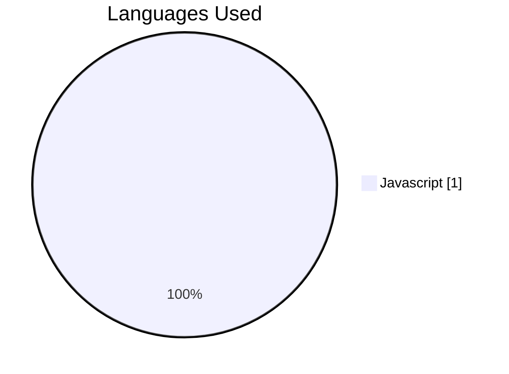
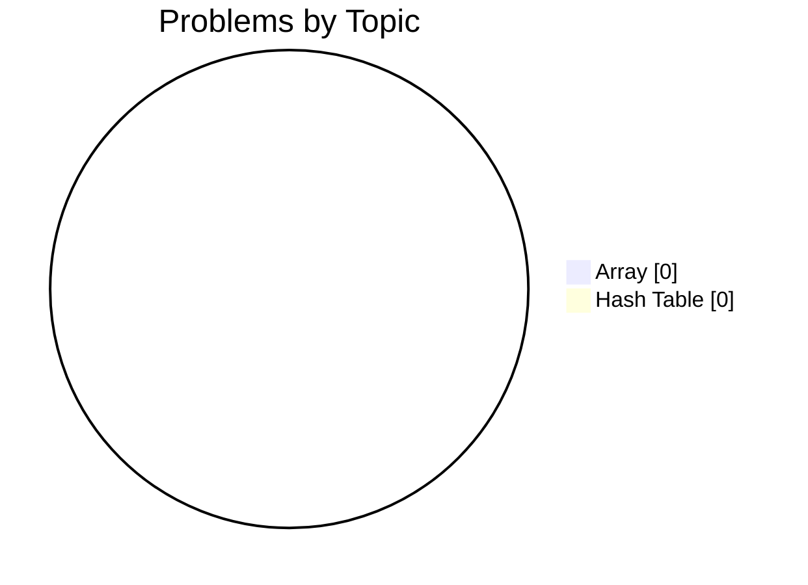

# 🚀 jakubpakula1's Developer Profile

<div align="center">

[](https://github.com/jakubpakula1)
[](https://gitcode.dev/u/jakubpakula1)
[](https://gitcode.dev/u/jakubpakula1)
[](https://gitcode.dev/u/jakubpakula1)

</div>

> **JavaScript Explorer | Laying the Foundations for Algorithmic Mastery**

An emerging developer focused on mastering JavaScript and core data structures. Currently building momentum through daily practice and initial explorations into problem-solving logic.

---

## 🧠 AI-Powered Insights

<table>
<tr>
<td width="33%" valign="top">

### ✅ Key Strengths
- Initial Momentum and Consistency
- Focus on Modern JavaScript
- Foundational Interest in Arrays and Hash Tables

</td>
<td width="33%" valign="top">

### 💡 Growth Areas
- Problem-Solving Success Rate
- Algorithm Implementation
- Code Efficiency and Execution

</td>
<td width="33%" valign="top">

### 🎯 Recommended Focus
- Strengthening Array manipulation skills
- Completing first 'Easy' difficulty challenge
- Building a consistent 7-day coding streak

</td>
</tr>
</table>

> *"The expert in anything was once a beginner."*

---

## 📊 Problem Solving Statistics

<table>
<tr>
<td width="50%">

### Overall Performance
| Metric | Value |
|:-------|------:|
| 🧩 Problems Attempted | **1** |
| ✅ Problems Solved | **0** |
| 📝 Total Submissions | **1** |
| 🎯 Success Rate | **0%** |
| ⚡ Avg Execution Time | **N/A ms** |

</td>
<td width="50%">

### Difficulty Breakdown
| Difficulty | Count |
|:-----------|------:|
| 🟢 Easy | 0 |
| 🟡 Medium | 0 |
| 🔴 Hard | 0 |

</td>
</tr>
</table>

---

## 🔥 Activity & Streaks

### Streak Stats

| 🔥 Current Streak | 🏆 Longest Streak | 📅 Last Activity | ✨ Active Today |
|:-----------------:|:-----------------:|:----------------:|:---------------:|
| **1 days** | **1 days** | **2026-02-03** | **✅ Yes** |

### 📅 Weekly Activity Pattern

| Day | Sun | Mon | Tue | Wed | Thu | Fri | Sat |
|:----|:---:|:---:|:---:|:---:|:---:|:---:|:---:|
| **Submissions** | 0 | 0 | 1 | 0 | 0 | 0 | 0 |
| **Success** | 0 | 0 | 0 | 0 | 0 | 0 | 0 |

```text
Weekly Activity Distribution
Sun │░░░░░░░░░░░░░░░░░░░░░░░░░░░░░░│ 0
Mon │░░░░░░░░░░░░░░░░░░░░░░░░░░░░░░│ 0
Tue │██████████████████████████████│ 1
Wed │░░░░░░░░░░░░░░░░░░░░░░░░░░░░░░│ 0
Thu │░░░░░░░░░░░░░░░░░░░░░░░░░░░░░░│ 0
Fri │░░░░░░░░░░░░░░░░░░░░░░░░░░░░░░│ 0
Sat │░░░░░░░░░░░░░░░░░░░░░░░░░░░░░░│ 0
```

### 📆 Contribution Heatmap (Last 30 Days)

```text
Contribution Activity (2026-02-03 to 2026-02-03)
2026-02-03 │▒▒│ 1 submissions (0 solved)
```

**Legend:** `░░` No activity | `▒▒` 1-2 submissions | `▓▓` 3-5 submissions | `██` 6+ submissions

---

## 💻 Language Proficiency



| Language | Submissions | Success Rate | Avg Time |
|:---------|------------:|-------------:|---------:|
| Javascript | 1 | 0% | N/A ms |

---

## 🎯 Topic Mastery



<details>
<summary>📋 Detailed Topic Statistics</summary>

| Topic | Solved | Attempted | Success Rate | Avg Time |
|:------|-------:|----------:|-------------:|---------:|
| Array | 0 | 1 | 0% | N/A ms |
| Hash Table | 0 | 1 | 0% | N/A ms |

</details>

---

## 🤖 AI Code Review Insights

*No AI feedback statistics available yet. Submit some code to get AI-powered reviews!*

---

## 📈 Progress Over Time


| Month | Problems Solved | Submissions | Success Rate |
|:------|----------------:|------------:|-------------:|
| 2025-09 | 0 | 0 | 0% |
| 2025-10 | 0 | 0 | 0% |
| 2025-11 | 0 | 0 | 0% |
| 2025-12 | 0 | 0 | 0% |
| 2026-01 | 0 | 0 | 0% |
| 2026-02 | 0 | 1 | 0% |

---

## 🏆 Achievements & Milestones

| Achievement | Description | Progress | Status |
|:------------|:------------|:--------:|:------:|
| **First Blood** 🔒 | Solve your first problem | `0/1` | 🔄 In Progress |
| **Getting Started** 🔒 | Solve 10 problems | `0/10` | 🔄 In Progress |
| **Problem Solver** 🔒 | Solve 50 problems | `0/50` | 🔄 In Progress |
| **Century Club** 🔒 | Solve 100 problems | `0/100` | 🔄 In Progress |
| **Hard Mode** 🔒 | Solve 5 hard problems | `0/5` | 🔄 In Progress |
| **Week Warrior** 🔒 | Maintain a 7-day streak | `1/7` | 🔄 In Progress |
| **Monthly Master** 🔒 | Maintain a 30-day streak | `1/30` | 🔄 In Progress |

---

## 📊 Performance Metrics

| ⚡ Avg Execution Time | 🚀 Best Execution Time | 💾 Avg Memory | 🎯 Best Memory |
|:---------------------:|:----------------------:|:-------------:|:--------------:|
| **N/A ms** | **N/A ms** | **N/A MB** | **N/A MB** |

---


## 📉 Computed Metrics

| Metric | Value | Description |
|:-------|:-----:|:------------|
| 🎯 Avg Difficulty Score | **0/3.0** | Average difficulty of solved problems |
| 📈 Consistency Score | **4/100** | Based on activity frequency and streaks |
| 🚀 Growth Rate | **0%** | Month-over-month improvement |

---

## 💡 Personalized Recommendations

- Focus on 'Easy' level Array problems to build confidence. - Explore MDN documentation for JavaScript Hash Table equivalents (Objects/Maps). - Set a goal to solve one problem completely this week. - Review basic Big O notation to understand performance.

---

<div align="center">

### 🌟 Summary

Every great developer starts with a single submission. By showing up and initiating your streak, you've already begun the process of transforming curiosity into technical expertise.

---

**Generated by [GitCode.dev](https://gitcode.dev)** | Last updated: 2026-02-03 20:00:51 UTC

<sub>
🔥 Current Streak: 1 days |
✅ Problems Solved: 0 |
🎯 Success Rate: 0%
</sub>

</div>