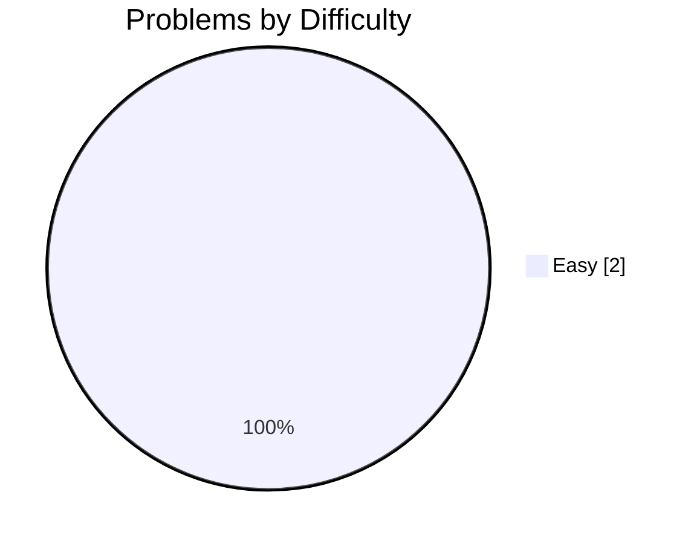
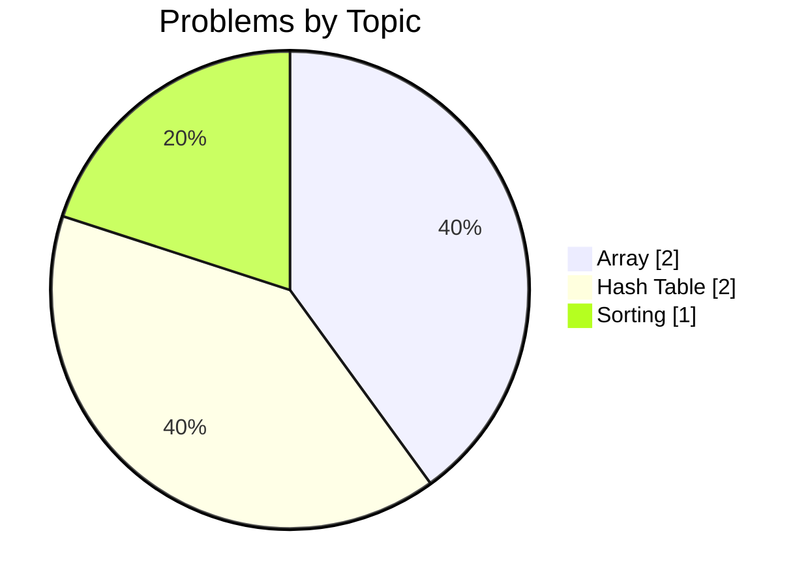
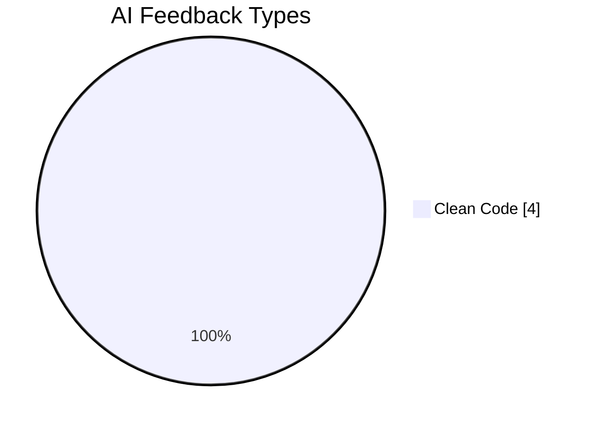
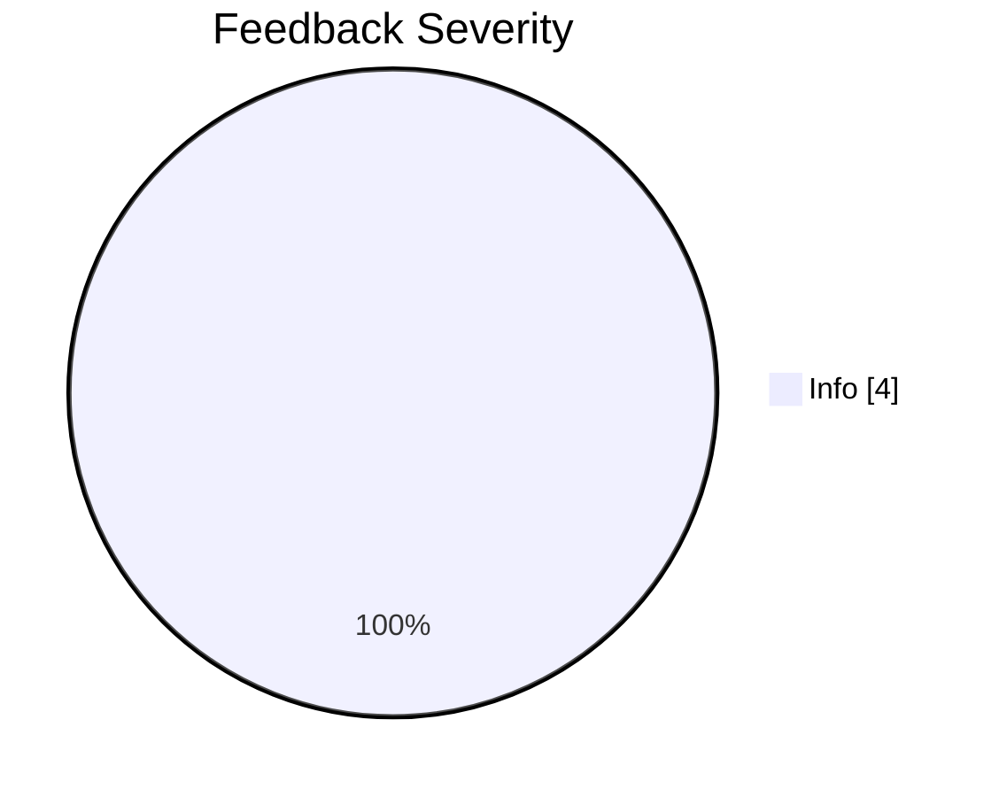
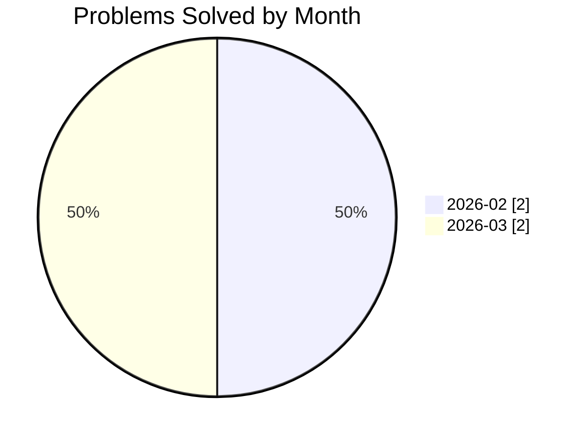

# 🚀 jakubpakula1's Developer Profile

<div align="center">

[](https://github.com/jakubpakula1)
[](https://gitcode.dev/u/jakubpakula1)
[](https://gitcode.dev/u/jakubpakula1)
[](https://gitcode.dev/u/jakubpakula1)

</div>

> **Aspiring Developer | Beginning the Journey**

A dedicated problem solver with 2 problems solved and a 46.2% success rate. Currently on a 2-day coding streak.

---

## 🧠 AI-Powered Insights

<table>
<tr>
<td width="33%" valign="top">

### ✅ Key Strengths
- Consistent practice habits
- Growing problem-solving skills
- Commitment to continuous improvement

</td>
<td width="33%" valign="top">

### 💡 Growth Areas
- Exploring more advanced algorithms
- Tackling harder difficulty problems

</td>
<td width="33%" valign="top">

### 🎯 Recommended Focus
- Continue daily practice to maintain streak
- Try medium-difficulty problems for growth
- Review AI feedback to improve code quality

</td>
</tr>
</table>

> *"Every expert was once a beginner. Keep coding, keep growing!"*

---

## 📊 Problem Solving Statistics

<table>
<tr>
<td width="50%">

### Overall Performance
| Metric | Value |
|:-------|------:|
| 🧩 Problems Attempted | **2** |
| ✅ Problems Solved | **2** |
| 📝 Total Submissions | **13** |
| 🎯 Success Rate | **46.2%** |
| ⚡ Avg Execution Time | **225.2 ms** |

</td>
<td width="50%">

### Difficulty Breakdown

```mermaid
pie showData
    title Problems by Difficulty
    "Easy" : 2
```

</td>
</tr>
</table>

---

## 🔥 Activity & Streaks

### Streak Stats

| 🔥 Current Streak | 🏆 Longest Streak | 📅 Last Activity | ✨ Active Today |
|:-----------------:|:-----------------:|:----------------:|:---------------:|
| **2 days** | **2 days** | **2026-03-10** | **✅ Yes** |

### 📅 Weekly Activity Pattern

| Day | Sun | Mon | Tue | Wed | Thu | Fri | Sat |
|:----|:---:|:---:|:---:|:---:|:---:|:---:|:---:|
| **Submissions** | 0 | 3 | 2 | 8 | 0 | 0 | 0 |
| **Success** | 0 | 2 | 1 | 3 | 0 | 0 | 0 |

```text
Weekly Activity Distribution
Sun │░░░░░░░░░░░░░░░░░░░░░░░░░░░░░░│ 0
Mon │███████████░░░░░░░░░░░░░░░░░░░│ 3
Tue │███████░░░░░░░░░░░░░░░░░░░░░░░│ 2
Wed │██████████████████████████████│ 8
Thu │░░░░░░░░░░░░░░░░░░░░░░░░░░░░░░│ 0
Fri │░░░░░░░░░░░░░░░░░░░░░░░░░░░░░░│ 0
Sat │░░░░░░░░░░░░░░░░░░░░░░░░░░░░░░│ 0
```

### 📆 Contribution Heatmap (Last 30 Days)

```text
Contribution Activity (2026-02-03 to 2026-03-10)
2026-02-03 │▒▒│ 1 submissions (0 solved)
2026-02-04 │▒▒│ 1 submissions (1 solved)
2026-02-25 │██│ 7 submissions (2 solved)
2026-03-09 │▓▓│ 3 submissions (1 solved)
2026-03-10 │▒▒│ 1 submissions (1 solved)
```

**Legend:** `░░` No activity | `▒▒` 1-2 submissions | `▓▓` 3-5 submissions | `██` 6+ submissions

---

## 💻 Language Proficiency


```mermaid
pie showData
    title Languages Used
    "Javascript" : 13
```

| Language | Submissions | Success Rate | Avg Time |
|:---------|------------:|-------------:|---------:|
| Javascript | 13 | 46.2% | 225.2 ms |

---

## 🎯 Topic Mastery


```mermaid
pie showData
    title Problems by Topic
    "Array" : 2
    "Hash Table" : 2
    "Sorting" : 1
```

<details>
<summary>📋 Detailed Topic Statistics</summary>

| Topic | Solved | Attempted | Success Rate | Avg Time |
|:------|-------:|----------:|-------------:|---------:|
| Array | 2 | 2 | 100% | 225.2 ms |
| Hash Table | 2 | 2 | 100% | 225.2 ms |
| Sorting | 1 | 1 | 100% | 268.5 ms |

</details>

---

## 🤖 AI Code Review Insights

<table>
<tr>
<td width="50%">

### Feedback by Type

```mermaid
pie showData
    title AI Feedback Types
    "Clean Code" : 4
```

</td>
<td width="50%">

### Feedback by Severity

```mermaid
pie showData
    title Feedback Severity
    "Info" : 4
```

| Severity | Count | Percentage |
|:---------|------:|-----------:|
| ℹ️ Info | 4 | 100.0% |
| ⚠️ Warning | 0 | 0.0% |
| 🚨 Critical | 0 | 0.0% |

**Total Reviews:** 4

</td>
</tr>
</table>

### 📈 Code Quality Trend

Continue focusing on writing clean, efficient code. Each code review is an opportunity to learn and improve.

---

## 📈 Progress Over Time


```mermaid
pie showData
    title Problems Solved by Month
    "2026-02" : 2
    "2026-03" : 2
```

| Month | Problems Solved | Submissions | Success Rate |
|:------|----------------:|------------:|-------------:|
| 2025-10 | 0 | 0 | 0% |
| 2025-11 | 0 | 0 | 0% |
| 2025-12 | 0 | 0 | 0% |
| 2026-01 | 0 | 0 | 0% |
| 2026-02 | 2 | 9 | 33.3% |
| 2026-03 | 2 | 4 | 75% |

---

## 🏆 Achievements & Milestones

| Achievement | Description | Progress | Status |
|:------------|:------------|:--------:|:------:|
| **First Blood** 🏆 | Solve your first problem | `1/1` | ✅ Achieved |
| **Getting Started** 🔒 | Solve 10 problems | `2/10` | 🔄 In Progress |
| **Problem Solver** 🔒 | Solve 50 problems | `2/50` | 🔄 In Progress |
| **Century Club** 🔒 | Solve 100 problems | `2/100` | 🔄 In Progress |
| **Hard Mode** 🔒 | Solve 5 hard problems | `0/5` | 🔄 In Progress |
| **Week Warrior** 🔒 | Maintain a 7-day streak | `2/7` | 🔄 In Progress |
| **Monthly Master** 🔒 | Maintain a 30-day streak | `2/30` | 🔄 In Progress |

---

## 📊 Performance Metrics

| ⚡ Avg Execution Time | 🚀 Best Execution Time | 💾 Avg Memory | 🎯 Best Memory |
|:---------------------:|:----------------------:|:-------------:|:--------------:|
| **225.2 ms** | **171 ms** | **N/A MB** | **N/A MB** |

---


## 📉 Computed Metrics

| Metric | Value | Description |
|:-------|:-----:|:------------|
| 🎯 Avg Difficulty Score | **1/3.0** | Average difficulty of solved problems |
| 📈 Consistency Score | **16/100** | Based on activity frequency and streaks |
| 🚀 Growth Rate | **0%** | Month-over-month improvement |

---

## 💡 Personalized Recommendations

- 📅 **Daily Practice**: Solve at least one problem per day
- 📈 **Level Up**: Attempt medium difficulty problems
- 🔍 **Learn from Feedback**: Review AI suggestions carefully
- 🎯 **Focus Topics**: Work on areas with lower success rates

---

<div align="center">

### 🌟 Summary

A developer making steady progress with 2 problems solved and a commitment to continuous learning.

---

**Generated by [GitCode.dev](https://gitcode.dev)** | Last updated: 2026-03-10 09:58:00 UTC

<sub>
🔥 Current Streak: 2 days |
✅ Problems Solved: 2 |
🎯 Success Rate: 46.2%
</sub>

</div>